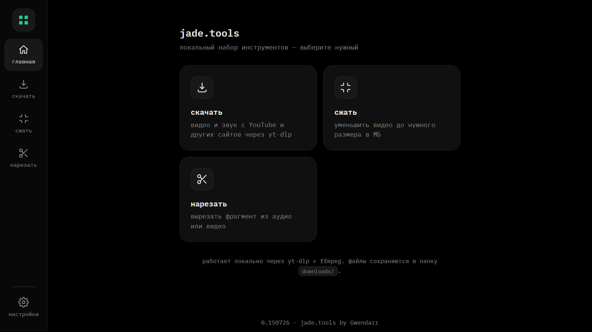
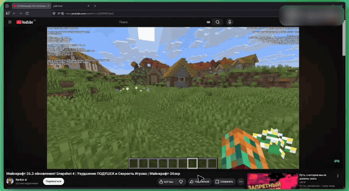
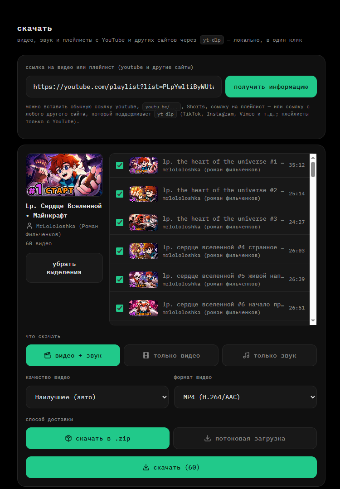
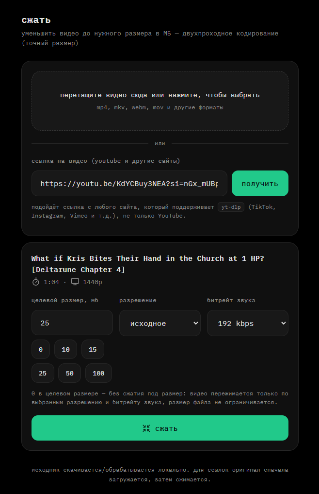
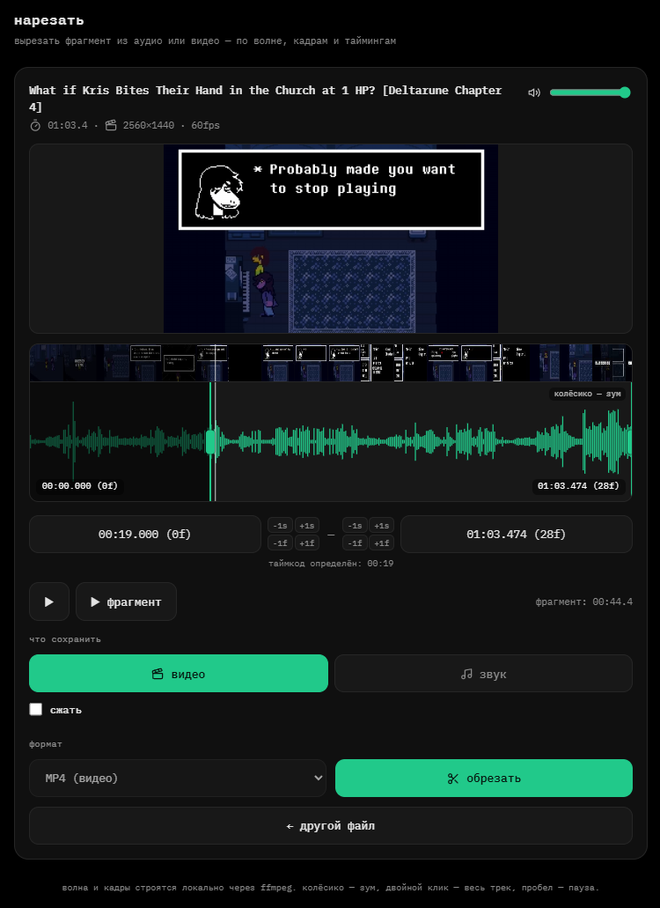
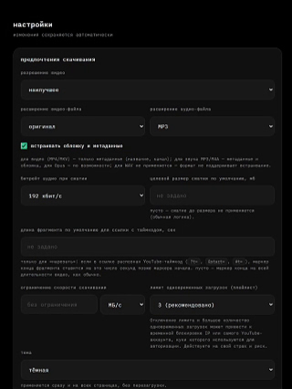

# jade.tools

Локальный мультитул для скачивания (YouTube и другие сайты через `yt-dlp`),
сжатия и нарезки видео/аудио. Работает через веб-интерфейс в браузере –
полностью локально, на вашем ПК.


*Главное меню веб-приложения*

## Возможности

### скачать

Видео, звук и плейлисты целиком с YouTube и других сайтов, поддерживаемых
`yt-dlp`: выбор качества и формата контейнера, для плейлистов – выбор
конкретных видео чекбоксами и доставка одним `.zip` или потоково.


*Скачивание одного видео*


*Скачивание плейлиста с выбором видео*

### сжать

Уменьшение видео до целевого размера в мегабайтах – например, чтобы уложиться
в лимиты вложений мессенджеров.


*Сжатие видео до нужного размера*

### нарезать

Вырезание фрагмента из видео или аудио, с автоподстановкой начала фрагмента
из таймкода в ссылке.


*Нарезка фрагмента*

## Настройки

Пути хранения временных файлов и кэша, cookies, тема оформления, лимит
одновременных загрузок плейлиста, статус внешних зависимостей – всё в одном
разделе настроек.


*Настройки приложения*

## Требования

- Windows.
- Внешние зависимости – `yt-dlp`, `ffmpeg`+`ffprobe`, `Deno`. Устанавливать их
  вручную не нужно: при первом обращении к инструменту, которому чего-то не
  хватает, приложение само предложит варианты установки (пик – до ~540 МБ
  свободного места на время установки, ~335 МБ после).

## Установка и запуск

**Обычным пользователям:** скачайте `.zip` из [Releases](../../releases),
распакуйте и запустите `jade.tools.exe`.

**Из исходников (для разработчиков):**

```bat
py -m pip install -r requirements.txt
py app.py
```

Подробности сборки exe и устройство проекта – в [ARCHITECTURE.md](ARCHITECTURE.md).

## Cookies

Для контента, требующего авторизации, режим «cookies из браузера»
поддерживает только Firefox и его форки (LibreWolf, Waterfox). Браузеры на
Chromium (Chrome, Edge, Opera, Brave, Yandex) не поддерживаются – с версии
127 они используют app-bound encryption, и внешний процесс не может прочитать
их cookies в принципе. Для таких браузеров можно экспортировать `cookies.txt`
вручную – см. настройки приложения.

## Антивирусы

Windows Defender и другие антивирусы иногда помечают `jade.tools.exe` как
вредоносный (встречалась метка вида `Trojan:Win32/Wacatac.B!ml`) – это
известное ложное срабатывание эвристики, а не реальная угроза. Причина
типична для PyInstaller-приложений: exe не подписан цифровой подписью, у него
низкая репутация файла из-за малого числа скачиваний, а само приложение
скачивает и запускает сторонние исполняемые файлы (`yt-dlp.exe`, `ffmpeg.exe`,
`deno.exe`) – по поведению это похоже на то, что делают вредоносные
загрузчики, хотя по содержимому файл чист.

Это не гарантия, что ложных срабатываний не будет вообще – у разных
антивирусов ситуация отличается.

Проверка конкретной сборки на VirusTotal: [отчёт для версии 0.280726](https://www.virustotal.com/gui/file/ced8515a0681930efd4c49e0e898ec048557c2347d6f6f0ef732611a0f867b37/detection)
(проверено в конце июля 2026). Ссылка привязана к хешу именно этой сборки – у
новых версий хеш будет другим, и для них стоит проверять заново самостоятельно
на [virustotal.com](https://virustotal.com).

Если антивирус сработал: добавьте исключение для `jade.tools.exe`, либо
проверьте файл сами на VirusTotal и сверьте хеш с указанным в README/Release.

## Происхождение

> Весь код этого проекта написан ИИ (Claude Code) – я не писал код вручную, за
> исключением изменения номера версии. Моя роль заключалась в проектировании:
> постановке задач, принятии архитектурных решений, тестировании и отладке
> каждой сборки. Я не профессиональный разработчик; проект создавался для себя
> и выложен на случай, если пригодится кому-то ещё.

## Про cobalt.tools

jade.tools – независимый некоммерческий проект, вдохновлённый
[cobalt.tools](https://cobalt.tools) (НЕ клон). Проект не связан с cobalt/imput,
не одобрен ими и не является их производным – весь код оригинальный.

## Лицензия

[MIT](LICENSE).

## Contributing

Это хобби-проект, развивается в свободное время – быстрых ответов и
регулярных обновлений не гарантирую, но слежу за Issues и Pull Requests.

- Нашли баг или есть предложение – заводите Issue.
- Хотите поправить код – присылайте Pull Request.

Техническое устройство проекта описано в [ARCHITECTURE.md](ARCHITECTURE.md).
